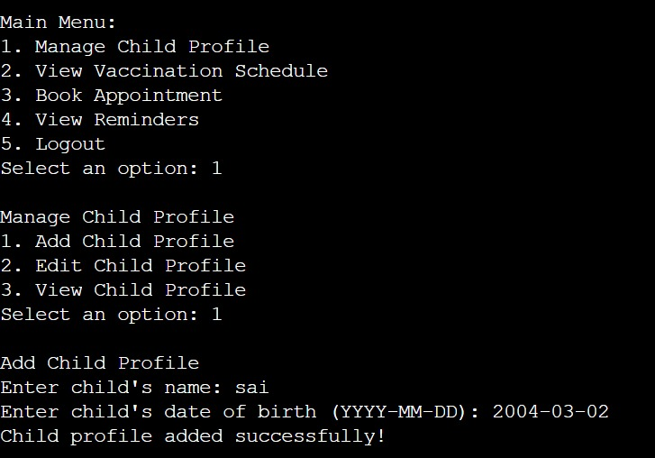

# hackthon-4
## Key Points

### 1. Centralized Input Handling
- The `get_input` method is used to standardize how user input is handled.
- This method optionally validates input against a list of allowed options.

### 2. Error Handling
- The system checks for invalid input (e.g., selecting a non-existent menu option).
- If invalid input is detected, the user is prompted to try again, ensuring smooth interaction.

### 3. Reusability
- The `get_input` method can be reused throughout the system wherever user input is needed.
- This reduces code duplication and improves maintainability.

### 4. Improved User Interaction
- By using `get_input`, the system is more user-friendly, preventing common errors and guiding the user through the correct steps.

### 5. Modular Design
- The system is structured in a modular way, with different methods handling specific tasks (e.g., `view_vaccination_schedule`, `book_appointment`).
- This makes the code easier to understand, debug, and extend.
## Screenshots

### 1. Register & Login

### 2. Manage Child Profile

### 3. View Vaccination Schedule

### 4.Book Appointment

### 5. View Reminders & Logout

